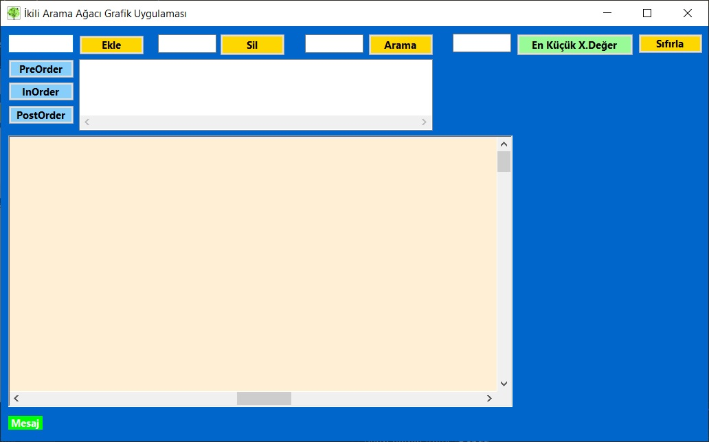
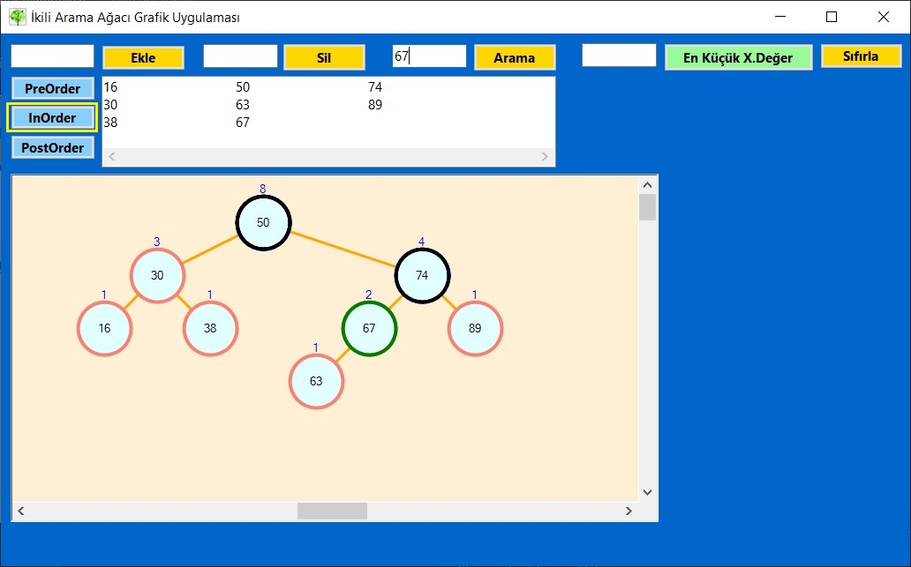
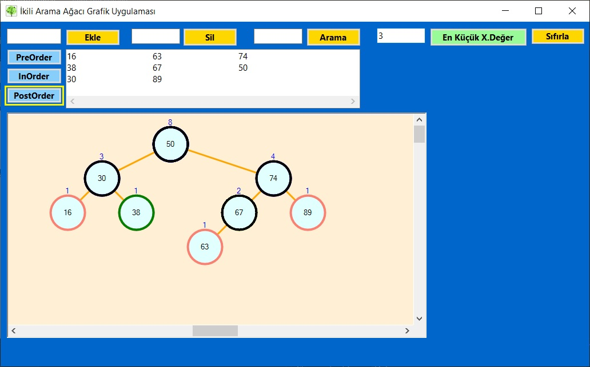

# Binary-Tree-Visualization
Bu masaüstü uygulaması, bilgisayar bilimlerinde önemli bir yer tutan Binary Trees (İkili Ağaçlar) konusunu öğrenmek isteyenler için geliştirilmiştir. Uygulama, C# Windows Form kullanılarak oluşturulmuştur ve ikili ağaçları görselleştirmek için kullanıcı dostu bir arayüze sahiptir.

## Özellikler
- İkili ağaçları oluşturma, ekleme ve silme
- İkili ağacı dolaşma (pre-order, in-order, post-order)
- Görsel olarak ikili ağacı görüntüleme
- İkili ağaçta değer arama
- İkili ağaçtaki en küçük n.değeri bulma

## Uygulama Ekran Görüntüleri
<table>
  <tr>
    <td>1</td>
  <tr>
    <td></td> 
 </table>

<table>
  <tr>
    <td>2</td>
  <tr>
    <td></td>
 </table>

 <table>
  <tr>
    <td>3</td>
  <tr>
    <td></td>
 </table>

 <table>
  <tr>
    <td>4</td>
  <tr>
    <td></td>
 </table>

---

## İletişim
Eğer herhangi bir sorunuz, öneriniz veya geri bildiriminiz varsa, bana aşağıdaki kanallardan ulaşabilirsiniz:
- LinkedIn: [LinkedIn Profilim](https://www.linkedin.com/in/hsynkbulut/)
- Medium: [Medium Profilim](https://medium.com/@hsynkbulut)
- E-posta: [E-mail adresim](mailto:hsyn.kbulut@gmail.com)